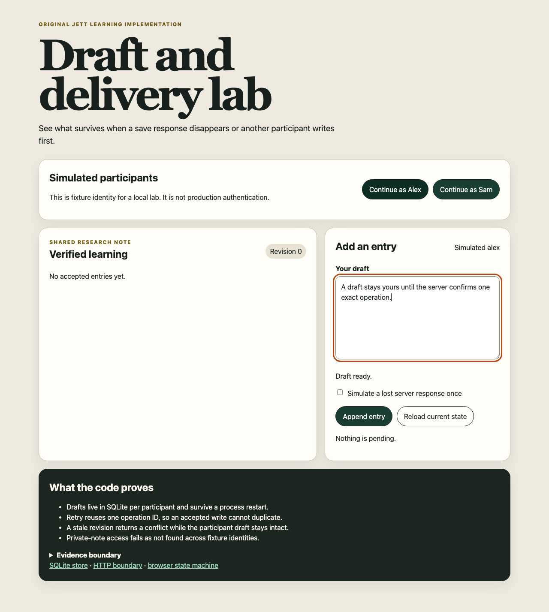

# Draft and delivery interaction lab

An original, runnable learning implementation derived from the Slack study’s reliability lessons. It does not contain Slack source code or private Slack content, and it is not a production identity or collaboration service.



## Run

Requires Node 22.5 or newer for `node:sqlite`; the verified development runtime is Node 26.7.0.

```sh
npm run lab:drafts
```

Open the printed loopback URL. Choose Alex in one private browser context and Sam in another. The database defaults to `.local/draft-delivery.sqlite`; override it with `JETT_LAB_DATABASE=/absolute/path.sqlite`.

## Journeys to inspect

1. Type a draft and reload. SQLite restores that participant’s draft.
2. Enable **Simulate a lost server response once**, append, then retry. The client reuses the operation ID and the timeline contains exactly one entry.
3. Open both personas before either writes. Let one append, then let the stale persona append. The server returns revision conflict and preserves the stale participant’s draft for review.
4. Follow the implementation links in the dark proof panel to read the exact store, HTTP and client modules in the browser.

## Backup and restore drill

Stop the lab so SQLite has no active writer, then export its complete logical state. The artifact is written atomically with owner-only mode `0600` and includes a SHA-256 integrity checksum.

```sh
npm run lab:drafts:backup -- export .local/draft-delivery.sqlite /tmp/jett-draft-backup.json
npm run lab:drafts:backup -- restore /tmp/jett-draft-backup.json /tmp/jett-restored.sqlite
JETT_LAB_DATABASE=/tmp/jett-restored.sqlite npm run lab:drafts
```

Restore accepts only an empty destination and runs as one transaction. It preserves drafts, entries, note revisions and accepted-operation records, so a retried operation after restoration remains idempotent. The checksum detects accidental or post-export modification; it is not encryption or a signature. The JSON contains the lab data in readable form and must remain in protected local custody.

## Verified behavior

- WAL-backed SQLite drafts and accepted entries survive close/reopen.
- Append and exact-draft clearing share one `BEGIN IMMEDIATE` transaction.
- Operation IDs are participant-scoped and payload-bound; retry returns the original response and different content fails closed.
- Fixture sessions use random cookies and CSRF tokens; mutation requires same origin.
- A participant receives `404` for another participant’s private note.
- Request and text limits fail closed.
- A real headless Chrome journey covers lost response, idempotent retry, conflict, reload and draft recovery.
- A command-line drill exports and transactionally restores a checksummed backup, including retry identity.
- axe-core reports zero automated violations at 1280×800 and 375×760.

Run the bounded suite:

```sh
npm run test:lab:drafts
```

The lab uses two hard-coded fixture identities. Its logical backup drill does not prove encrypted production backup custody, scheduled backup operation, disaster recovery, production account authentication, authorization policy, multi-instance coordination or release readiness.
