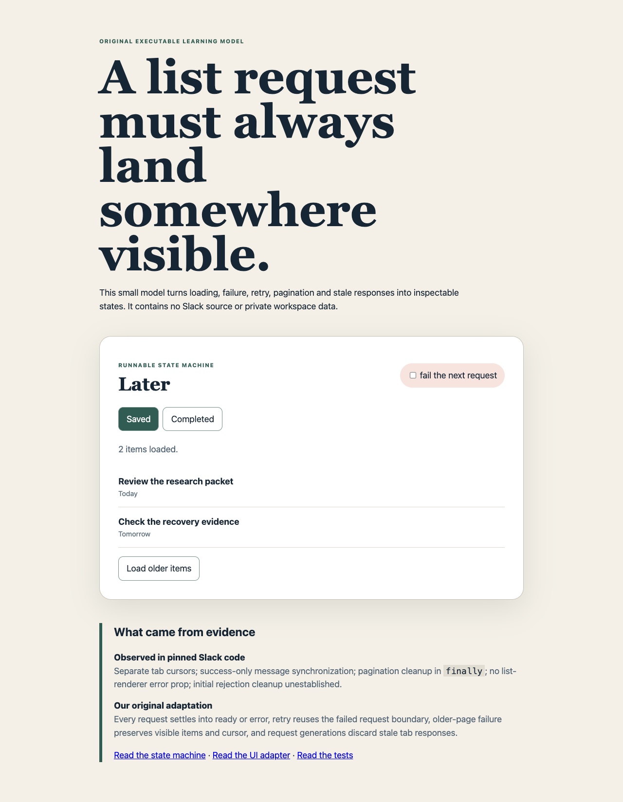

# Later request recovery lab

An original executable model derived from the Slack Later source study. It contains no Slack source code, UI assets or private workspace data.



```sh
npm run lab:later
```

Use **fail the next request** before loading a tab or older page. Initial failure becomes a visible retry action. Older-page failure keeps existing items and the cursor. Switching tabs while a slower request is running demonstrates that request generations prevent the old response from replacing the current tab.

The pinned Slack code establishes separate tab cursors, success-only linked-message synchronization, pagination cleanup in `finally`, a list renderer without an error prop and an initial-fetch rejection path whose cleanup is not established. This lab adds explicit recovery behavior as a JETT design proposal; it is not a claim that Slack implements this model.

```sh
npm run test:lab:later
```
